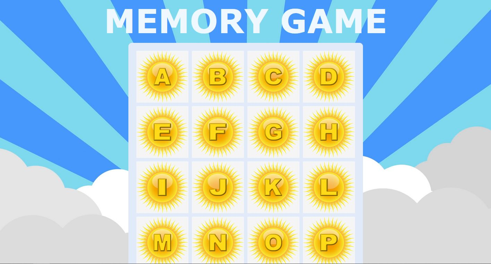
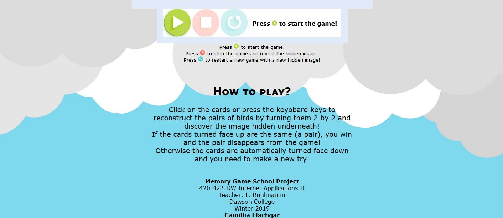

Assignment made for class 420-423-DW Internet Applications II (JavaScript), taught by Laurent Ruhlmann at Dawson College, in Winter 2019.  

### Coded in
* Javascript (no JQuery), HTML and homemade CSS

# Game

